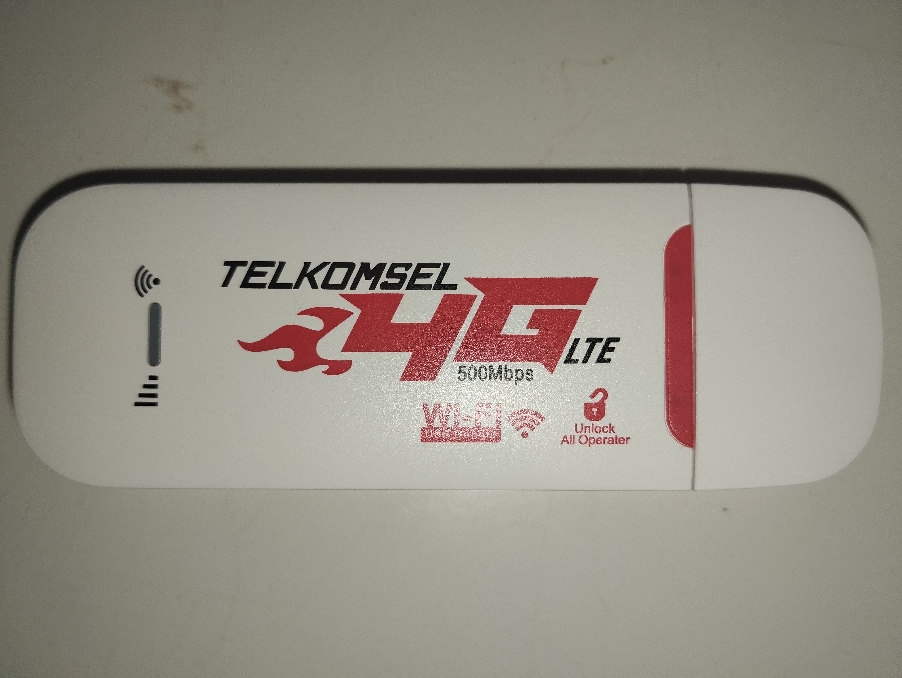
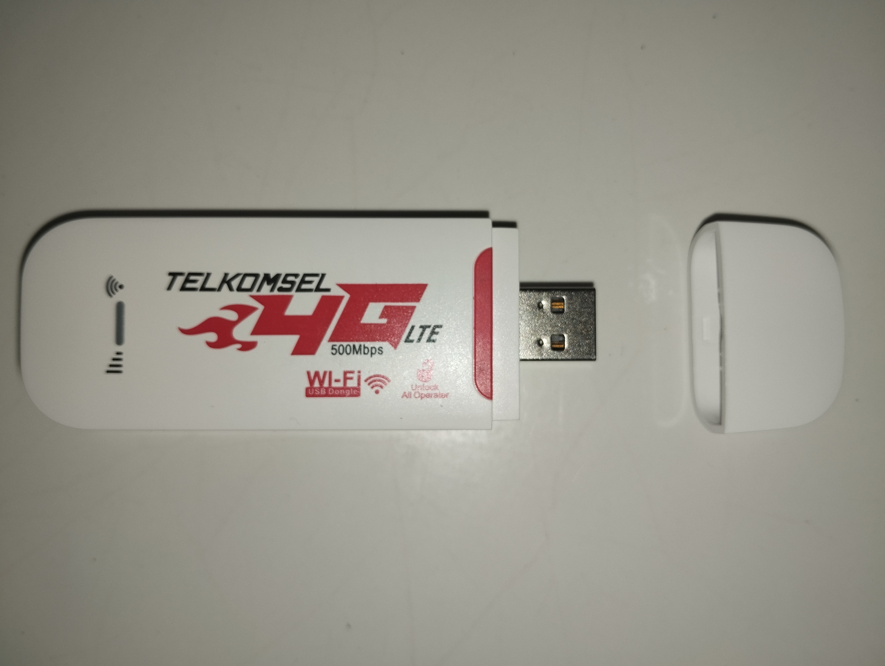

# Myblueberry-TelkomFiUSB
My Genericaly MSM8916 Modem with Telkomsel labled 🔥🌱

# Logo
> This logo is copyrighted by the Telkomsel company.

## Modem logo

# 📡 USB Modem Full Specifications (Telkomsel-branded, ~IDR 100K)

## 🔧 1. Main Chipset
- **Qualcomm MSM8916**
  - 64-bit ARM Cortex-A53 Quad-Core SoC (1.2–1.4 GHz)
  - Integrated **LTE Category 4 Modem** (150 Mbps DL / 50 Mbps UL)
  - GPU: Adreno 306
  - Used in entry-level smartphones (e.g. Xiaomi Redmi 2, Samsung J1 Ace)
  - Supports Android/Linux (but locked down in this case)

---

## ⚡ 2. Supporting Chips
- **Qualcomm PM8916**
  - Power Management IC (PMIC)
  - Provides power control for CPU, RF, modem, charging, etc.

- **Integrated Modem**
  - LTE Category 4 (No Carrier Aggregation)
  - Peak speeds: **150 Mbps Download / 50 Mbps Upload**
  - Real-world: ~10–50 Mbps depending on signal & carrier
  - *Note:* The “500 Mbps” claim on the label is **marketing exaggeration**

---

## 🧠 3. Memory (eMCP - embedded Multi-Chip Package)
- **SK Hynix H9TQ32A4GTMCUR-KUM**
  - Combines:
    - **4 GB LPDDR3 RAM**
    - **4 GB eMMC Flash Storage**
  - All in one stacked BGA chip
  - Same type used in Android phones (2015–2016 era)

---

## 💻 4. System / Firmware
- Closed firmware, **not flashable** or bootloader-unlocked
- No Linux / OpenWrt support out of the box
- No known root, UART, or console access
- Functions only as a **plug-and-play USB modem**

---

## 🚀 5. Performance Overview
| Feature             | Value                                |
|---------------------|---------------------------------------|
| LTE Category        | Cat 4 (no 4G+, no CA)                 |
| Download Speed      | 150 Mbps (theoretical)                |
| Upload Speed        | 50 Mbps (theoretical)                 |
| Real-world Speed    | ~10–50 Mbps                          |
| RAM                 | 4 GB LPDDR3                           |
| Storage             | 4 GB eMMC (usable ~3.7 GiB)           |
| OS / System         | Embedded firmware (not user modifiable) |
| Hardware Class      | Entry-level smartphone (2015–2016 era) |

---

## ✅ 6. Conclusion
- ✅ **Good value for IDR ~100K** if you just need a basic 4G USB modem
- ❌ Not suitable for custom OS, OpenWrt, or advanced networking
- ❌ Not a real 500 Mbps LTE modem (no 4G+)
- ⚠️ Best used for simple internet access via PC/router USB port

If you're looking for a rootable, hackable LTE modem with Linux/OpenWrt potential, look for:
- **MiFi with OpenWrt support**
- Devices based on **Qualcomm QCA9531**, **MediaTek MT7620**, or **Huawei E5577s** (some variants)

# Picture modem

